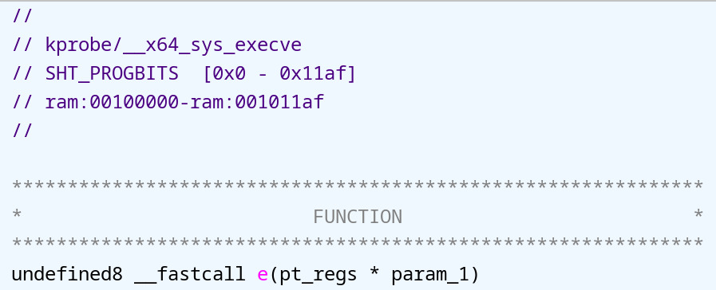
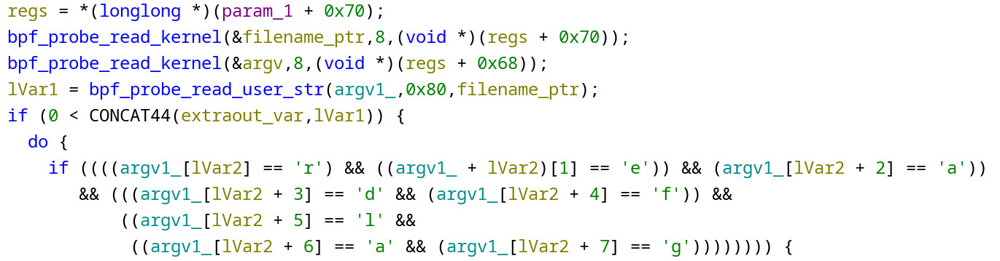
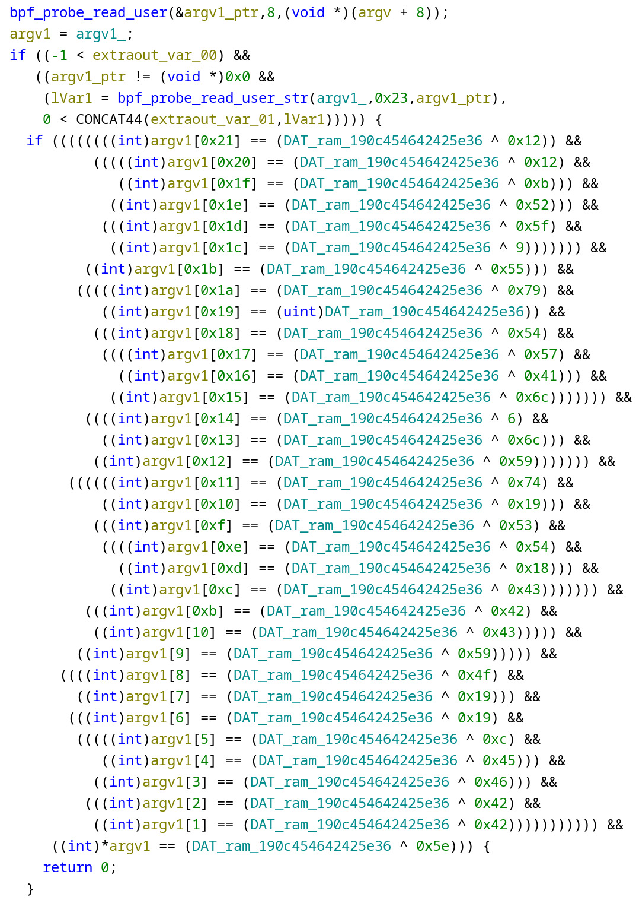
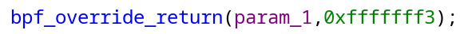

# Buzzing

## Description

Run `/readflag` to get flag.

Note: There is always an instance on the server that is run by the author.

## Writeup

This is an easy challenge, mostly a decoy for the harder, follow-up challenge.

The `loader` binary is just an eBPF loader; the real logic lives in `locker.bpf.o`. IDA doesn't handle eBPF binaries very well, so we'll use Ghidra for this type of challenge.

The `e` function is a handler for `kprobe/__x64_sys_execve`, used to hook the `execve` syscall. You can quickly confirm this by:



The first part checks whether the file name equals `/readflag`:



You can determine the parameters of the helper from the blog post [eBPF Doable and Undoable](https://sighingnow.github.io/linux/ebpf_doable_and_undoable.html).

The second part checks whether the first parameter of the `/readflag` command matches a simple XOR-based check:



If the parameter doesn't match, the syscall will be denied:



Here is the solve script. Be careful not to trigger the `$$` metacharacter in the shell:

```py
r = ssh("bocchi", "spawner.zaki.moe", 10149, keyfile="/tmp/id_ed25519")
print(r.run("/readflag https://youtu.be/BoZ0Zwab6Oc?id=\$\$").recvall())
```

This challenge has so many way to bypass the check, one of them is to use a symlink to trigger the `/readflag`. Since the name doesn't match, it won't be blocked by the eBPF program.

```
ln -sf /readflag /tmp/x
/tmp/x
```

Flag: `W1{just_4_s1mpl3_3bpf_l04d3r_buzz1n'_4r0und_fufu_76274bc788378a36b3345a49948045e9}`
