# Quit buzzing around

## Description

Run `/readflag` to get the flag.

You have to solve the Buzzing challenge before attempting this one. You must also understand Docker, eBPF, and the Linux kernel very well to be able to defeat this challenge.

Hint for you: Are Docker containers really isolated?

## Writeup

When triggering `/readflag`, a `Permission denied` message is thrown, just like in the first challenge. There must be a check somewhere—let's examine the `loader` binary.

We'll use IDA for analyzing this binary, as it works best with x86/x64 binaries. In this eBPF challenge, the usual eBPF object `locker.bpf.o` has disappeared because it's embedded inside the `loader`. The eBPF object's location is pointed to by `unk_2B0B` with a size of 52280 bytes.

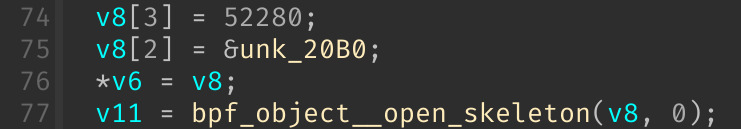

It can be easily extracted using:

```sh
dd if=loader of=locker.bpf.o bs=1 count=52280 skip=8368
```

Next, load the extracted `locker.bpf.o` into Ghidra to continue the analysis.

### memset

There's a sneaky 32-byte memset operation here. `_OWROD` is an unknown type representing 16 bytes of data, as noted in [Igor's tip of the week #45: Decompiler types](https://hex-rays.com/blog/igors-tip-of-the-week-45-decompiler-types).

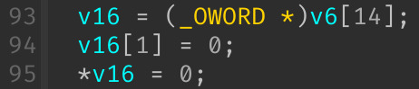

This operation clears data at the start of the eBPF's `.data` section:

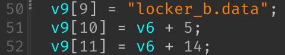

As shown, it zeros out the `g` variable in eBPF. We'll rename this variable to `zeroed`:

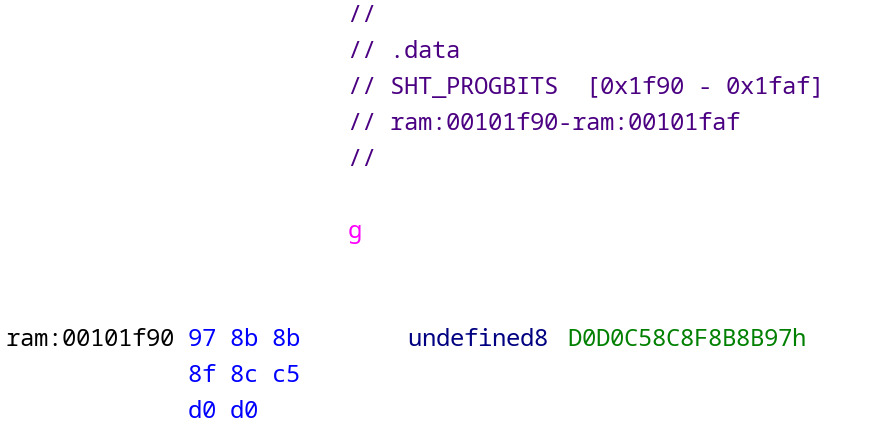

### namespace

Right below the memset operation, the inode number of the current namespace mountpoint is stored at eBPF's `.bss` + 8:

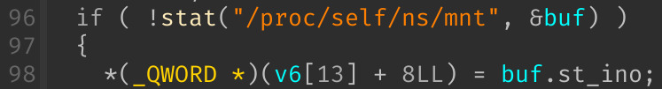

This corresponds to the `k` variable, which we'll rename to `mnt_ns`.

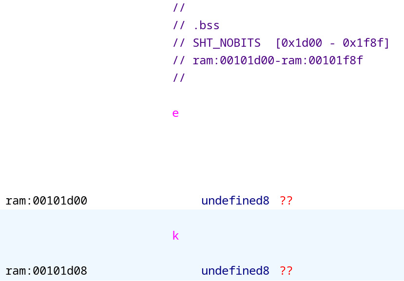

### timer

The code makes a `bpf_map` call, then mmaps a region from the result to `qword_100D0`. Following this, it calls `sub_1290` and enters a loop.

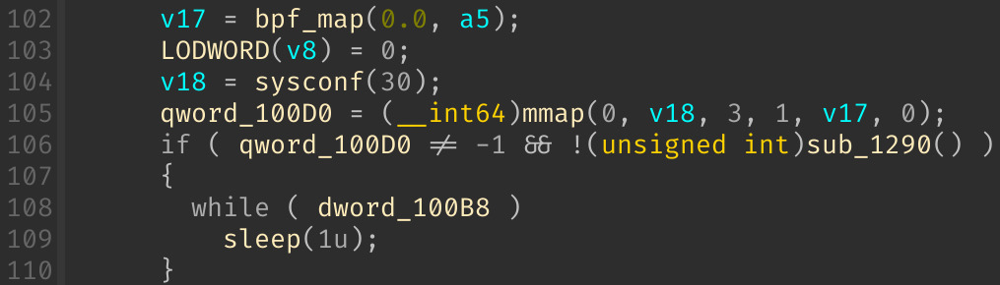

The `sub_1290` function performs a hardware check using information from `/proc/version` and `/proc/cpuinfo`.

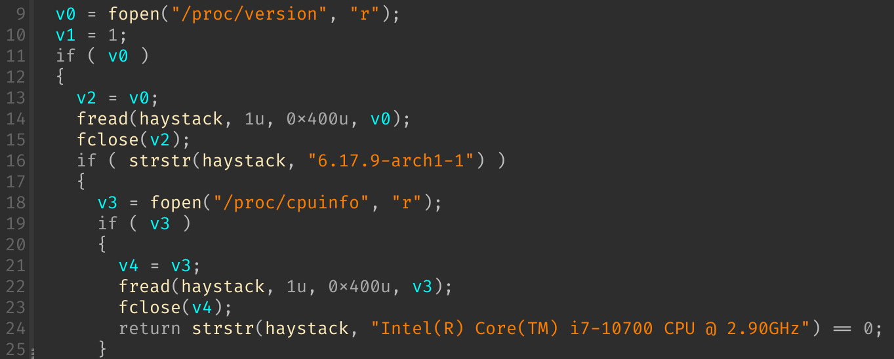

Returning to the mmapped region, a simple cross-reference reveals that `qword_100D0` is used in the `start_routine` function:

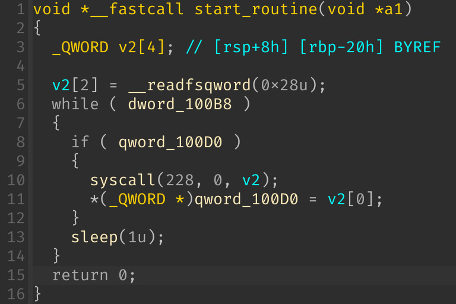

Syscall 288 is [clock_gettime](https://www.chromium.org/chromium-os/developer-library/reference/linux-constants/syscalls/#x86_64_228), which retrieves the current time in seconds and stores it in `qword_100D0` every second.

The `start_routine` is a separate worker thread spawned by the `sub_13E0` constructor. We can confirm this by observing that it resides in the `.init_array` section.

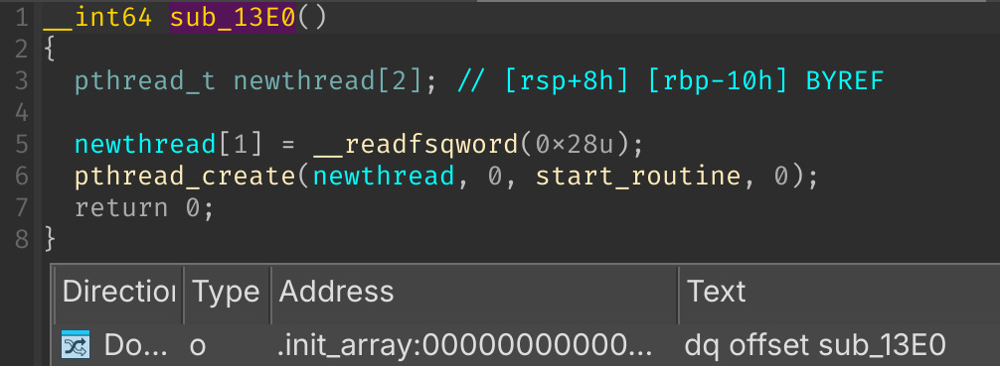

Where does the retrieved time actually get stored? The `bpf_map` call internally retrieves the file descriptor of the map and stores it in `r15`.

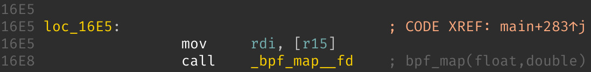

The `r15` register references a map called `d`:

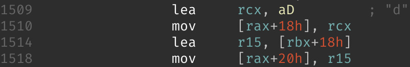

Thus, the time is uploaded to eBPF via the `d` map. We'll rename it to `current_time_map` in Ghidra. Since there's no more interesting information in the `loader`, we'll now switch our focus to analyzing `loader.bpf.o`.

---

Based on the header comments of `h`, `i`, `j`, similar to what we did in the Buzzing challenge, we can rename them as follows:

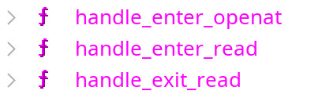

### handle_enter_openat

There's a namespace check at the beginning of the function to prevent from cooking other containers' `openat` syscalls.

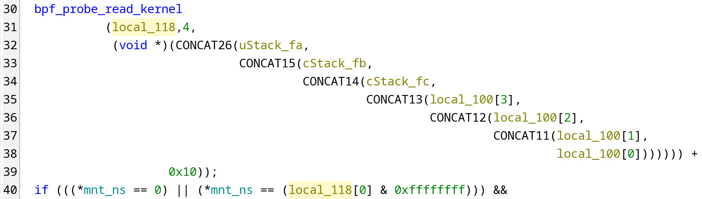

Next, it reads data from userspace process memory into `local_100` and stores the PID of that process in `local_104`. We'll rename `local_104` to `pid`. Moreover, there's a check that compares `local_100` to `/flag\x00`, so this variable is the filename parameter of the `openat` syscall—we'll call it `filename`:

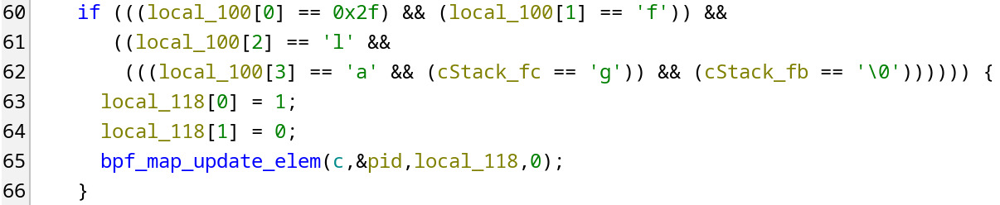

It then updates the `c` map using the pid as the key, with the value `{1, 1}`.

`param_1 + 0x18` is the offset of the `path` parameter of `int openat(int dirfd, const char *path, int flags, ...)`. The `trace_event_raw_sys_enter` is the type of `param_1`, which is the standard type for `sys_enter_xxx` tracepoints. The `sys_exit_xxx` tracepoints use `trace_event_raw_sys_exit` instead. Their layouts can be found in `vmlinux.h`:

```c
struct trace_entry {
	short unsigned int type;
	unsigned char flags;
	unsigned char preempt_count;
	int pid;
};

struct trace_event_raw_sys_enter {
	struct trace_entry ent; // 8 bytes
	long int id; // 8 bytes
	long unsigned int args[6]; // 48 bytes
	char __data[0];
};

struct trace_event_raw_sys_exit {
	struct trace_entry ent;
	long int id;
	long int ret;
	char __data[0];
};
```

We'll rename `param_1` to `ctx`, create a `trace_event_raw_sys_enter` struct, and apply it to the parameter. This can be accomplished in Ghidra by navigating to File -> Parse C Source... and importing the structs shown above. However, before importing, we need to change `long int` to `long long` and `long unsigned int` to `unsigned long long`, as Ghidra interprets `long int` as 4 bytes rather than 8. Once imported, we'll have the following struct definition:

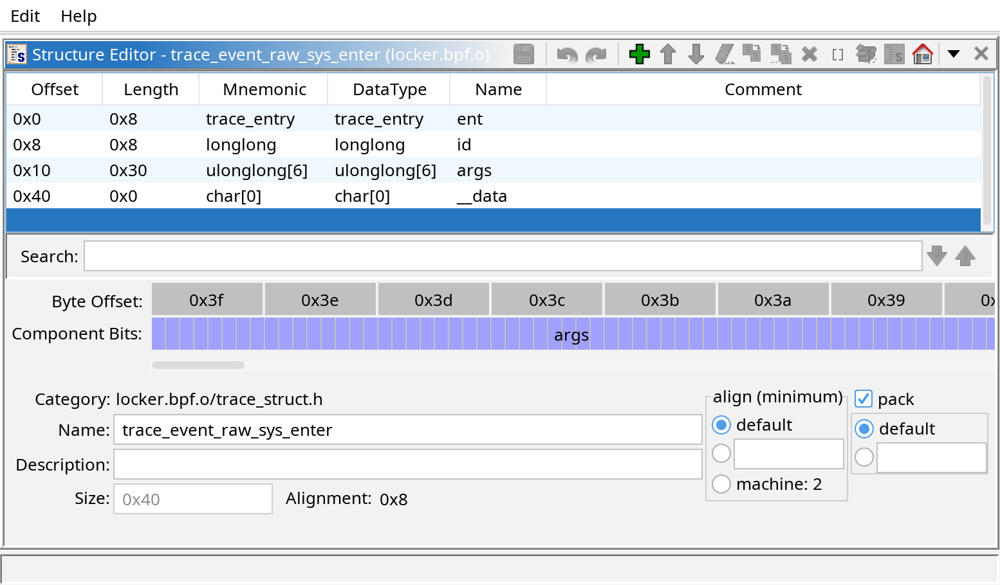

Right above this, there's a check verifying whether the filename (with `\x00`)'s FNV-1a hash equals `0x93b9a1eb4054d0b`. The constants `0x00000100000001b3` and `0xcbf29ce484222325` are the two standard parameters of the FNV hash family, as documented in [FNV hash parameters](https://en.wikipedia.org/wiki/Fowler%E2%80%93Noll%E2%80%93Vo_hash_function#FNV_hash_parameters).

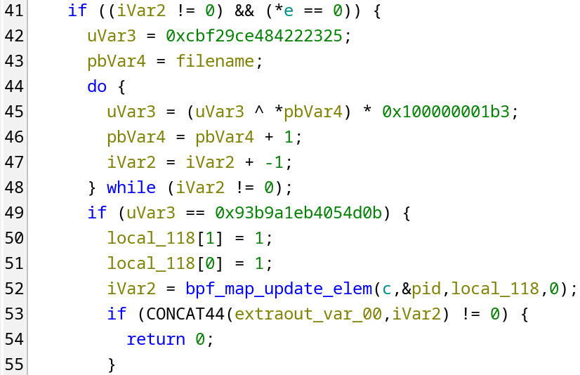

Following this check, the code updates the `c` map with `{1, 1}`.

The hash `0x93b9a1eb4054d0b` corresponds to `/proc/version\x00`, which is read by the hardware checking function `sub_1290` in the `loader`.

Therefore, the second value in the `c` map's pair indicates the file type: `1` represents `/proc/version`, while `0` represents `/flag`.

### handle_enter_read

This handler performs one simple task: if the current process is accessing a targeted file (indicated by the first element of the pair being `1`), it updates that element with the second parameter from the `read` syscall, which is the `buf` address.

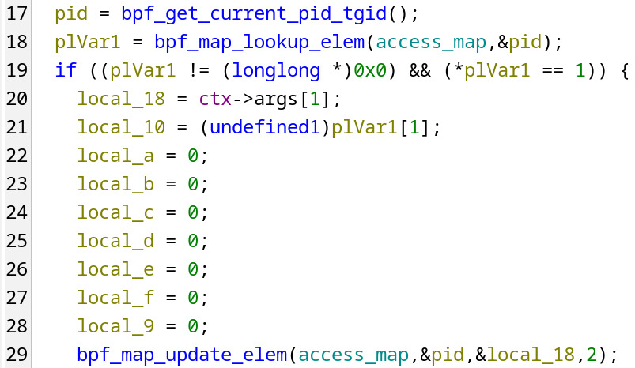

We'll rename the `c` variable to `access_map` and create an `access_info` struct for it containing two members: `buf` and `is_proc_version`.

### handle_exit_read

This handler is where the encryption takes place. It uses the ChaCha20 cipher as described in [Chacha20 Algorithms](https://xilinx.github.io/Vitis_Libraries/security/2019.2/guide_L1/internals/chacha20.html). The state matrix is structured as follows:

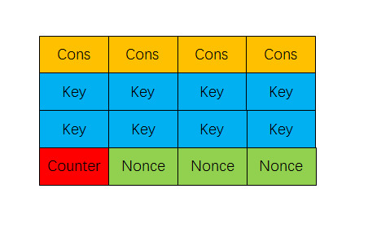

We can easily identify this layout thanks to the `expand 32-byte k` constant:

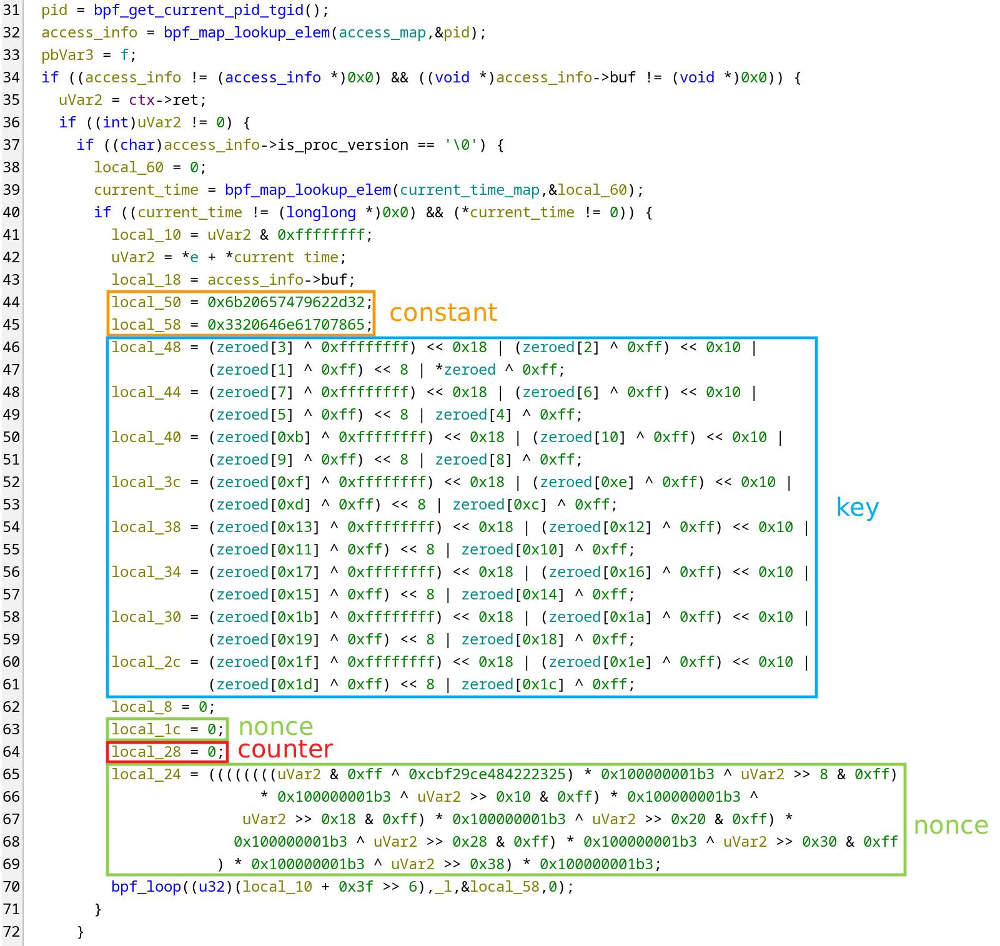

When `access_info->is_proc_version == 0`, the current process isn't accessing `/proc/version` but rather reading `/flag`, which triggers the encryption. The nonce is constructed from the FNV-1a hash of `e` + `current_time`, padded with zeros in `local_1c`. The value of `e` is calculated in the `else` branch and represents the FNV-1a hash of `/proc/version`'s contents:

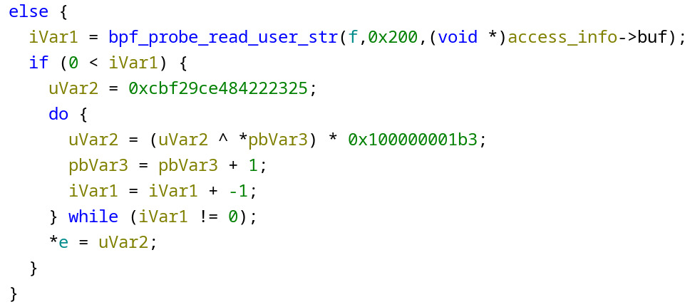

The encryption key is simply the 32-byte `zeroed` array XORed with `0xff`.

Combining all these elements gives us the necessary information to decrypt the flag.

### Shared Linux kernel

We didn't find any code that blocks the execution of `/readflag`, so it must be something external. The hint asks "Are Docker containers really isolated?"—and the answer is no, they aren't. Docker containers share the Linux kernel by design.

Both the Buzzing and Quit buzzing around challenges are hosted on the same host. Remember the seemingly useless note in the Buzzing challenge description?

> There is always an instance on the server that is run by the author.

Due to the shared kernel design and the confirmation that an instance of the Buzzing challenge is always running, that's the culprit causing the `Permission denied` error when executing `/readflag`.

The solution is straightforward: use the exploit from the Buzzing challenge to bypass the restrictions and run `/readflag`, then decrypt the resulting encrypted flag.

### Solution script

Below is the solution script. Since the encrypted flag can contain null bytes that disrupt `printf` output, we need to run it multiple times until we retrieve the complete encrypted flag.

```py
from Crypto.Cipher import ChaCha20
from pwn import ssh


def fnv1a(data):
    hash = 0xCBF29CE484222325
    prime = 0x00000100000001B3
    for i in range(len(data)):
        hash = (hash ^ data[i]) * prime & 0xFFFFFFFFFFFFFFFF
    return hash

def solve():
    r = ssh("bocchi", "spawner.zaki.moe", 10895, keyfile="/tmp/id_ed25519")

    enc = r.run("/readflag https://youtu.be/BoZ0Zwab6Oc?id=\$\$").recvall()[:-1]
    timestamp = int(r.run("date +%s").recvline())

    proc_version_hash = fnv1a(r.download_data("/proc/version") + b"\x00")

    for t in range(5):
        sum = (timestamp - t + proc_version_hash) & 0xFFFFFFFFFFFFFFFF
        totp = fnv1a(sum.to_bytes(8, "little"))
        nonce = totp.to_bytes(8, "little") + b"\x00" * 4

        cipher = ChaCha20.new(key=b"\xff" * 32, nonce=nonce)

        flag = cipher.decrypt(enc)
        if flag.startswith(b"W1{") and flag.endswith(b"}"):
            return flag

    return None

while True:
    flag = solve()
    if flag:
        print(flag.decode())
        break

    print("Missing pieces. Retrying...")
```

Flag: `W1{3v3n_7h3_4u7h0r_607_h0r53d_4r0und_by_7h3_buzz1n6_0f_3bpf_ec39a82cb62595db9e5ef81861563590}`

Besides the intended solution, there are some interesting unintended solutions discovered by players, such as exploiting race conditions, ...
